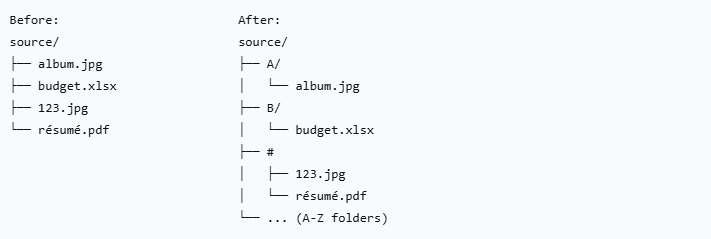

# Move to A-Z

A lightweight Python script that organizes files into alphabetical (A-Z) folders with full Unicode support and filesystem compatibility.

## Features

- **Automatic A-Z folder creation** - Creates 26 alphabetical folders + one "#" folder
- **Unicode-aware sorting** - Handles non-ASCII characters safely
- **Filesystem compatible** - ASCII-only folder names work with FAT/exFAT/NTFS
- **Safe operations** - Prevents overwrites with automatic naming
- **Dry-run mode** - Preview changes before executing
- **Copy or Move** - Choose between copying or moving files

## 📸 Screenshot



## Installation

```bash
# Clone the repository
git clone https://github.com/elaichix/A-Z-File-Organizer.git
cd move_to_az

# No dependencies required - uses Python standard library only
